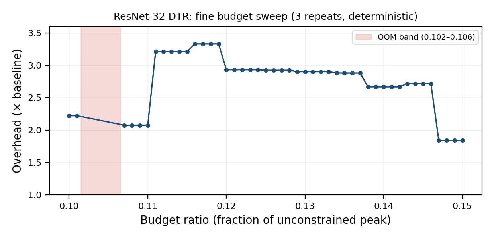
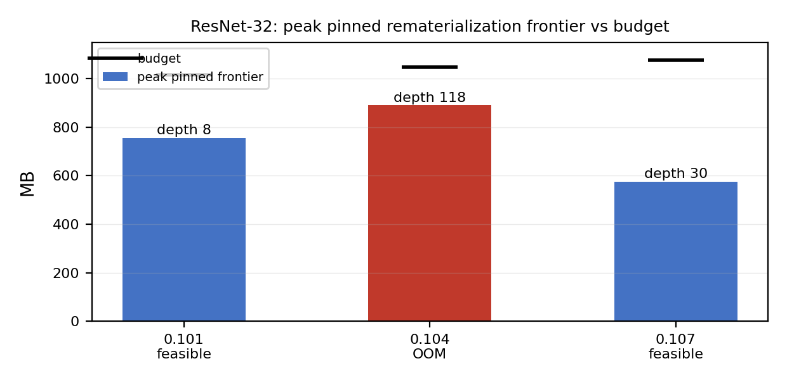

# Deterministic Regime Switching and Feasibility Inversion in DTR

This repository contains the reproducibility package for an empirical investigation of **Dynamic Tensor Rematerialization (DTR)** under constrained memory.

The experiments identify deterministic regime changes in simulated DNN training, including memory ranges in which increasing the available memory can change a previously feasible execution into an out-of-memory execution.

The repository contains the experiment scripts, raw results, instrumentation, and figures required to reproduce the reported observations.

> **Scope:** All experiments in this repository use the `simrd` simulator from the public DTR artefact. These results are simulator results, not measurements from a production DNN runtime.

## Source

- Simulator: [DTR public artefact](https://github.com/uwsampl/dtr-prototype)
- `simrd` commit: `eff53cc4804cc7d6246a6e5086861ce2b846f62b` (2021-03-17)
- Traces (in `simrd/logs/`, from the artefact's `logs.zip`):
  - LSTM: `lstm-128-11000000000.0-2020-10-1-16-38-52-default.log`
  - ResNet-32: `resnet32-56-9000000000.0-2020-10-1-13-3-30-default.log`

## Environment

- Reproduced identically on Python 3.11.15 (Linux) and Python 3.13 (Windows).
- Dependencies: `attrs`, `dill`, `pathos`, `multiprocess`, `numpy` (`simrd`'s runtime dependencies).
- Do **not** install `simrd/requirements.txt` (2020-era pins); install the imports directly.
- `PYTHONPATH` must include the `simrd` package directory:

```text
dtr-prototype/simrd
```

## Configuration

Configuration is identical across all runs unless noted.

- Runtime class: `RuntimeV2EagerOptimized`
  - Required for DTR's region features.
  - `RuntimeV1` lacks the `regions` feature and errors.
- Heuristics:
  - DTR
  - AbESize
  - AbEStale
  - AbE

  The last three are from `simrd/heuristic/ablation.py`.

- Budget in bytes:

```text
int(unconstrained_peak_bytes * ratio)
```

- Overhead:

```text
(model_compute + remat_compute) / model_compute
```

### Termination classes

The experiments distinguish the following termination conditions:

- **OOM** — `MemoryError` raised in `RuntimeV2._free` when the evictable pool is empty and the requested allocation still does not fit.
- **thrashed** — `RematExceededError` when `remat_compute` exceeds `remat_limit`; this is **not used for the OOM results**.
- **RecursionError** — Python stack exhaustion during deep `_materialize` recursion (LSTM at very low budgets).

## Repeats and instrumentation

Each point is run using a fresh runtime.

The ResNet OOM band was additionally reproduced in independent OS processes, with one point per process.

Instrumentation patches do not change eviction decisions; they only widen limits or add logging:

- `sys.setrecursionlimit(1_000_000)` + `threading.stack_size(256 MB)`, run in a thread.
  - Required for deep `_materialize` recursion.
  - On Windows, use a 64 MB stack.
- `remat_limit` is set to `inf` for the OOM/frontier probes so OOM is not pre-empted by the overhead cap.
- Trace/telemetry hooks used for victim-order and frontier measurements are read-only.

## Reproduction commands

### Fine ResNet sweep

0.100–0.150 in 0.001 steps, with 3 repeats:

```bash
python stage1_probe.py <resnet_log> \
  --ratios 0.100,0.101,...,0.150 \
  --repeats 3 \
  --overhead-limit 60 \
  --out results/resnet_fine.json
```

### LSTM overhead switching

Five budgets, with 3 repeats:

```bash
python stage1_probe.py <lstm_log> \
  --ratios 0.268,0.266,0.265,0.264,0.262 \
  --repeats 3 \
  --overhead-limit 60 \
  --out ...
```

### LSTM ablations

Use the same command with:

```text
--heuristic AbESize
--heuristic AbEStale
--heuristic AbE
```

### LSTM victim-order analysis

```bash
python scripts/victim_order.py
```

### ResNet OOM allocation snapshot

```bash
python scripts/oom_probe.py
```

### Frontier comparison

```bash
python scripts/frontier_fix.py
```

## Figures

### ResNet-32 memory-budget sweep



### Pinned-memory frontier



## Raw results included

- `results/resnet_fine.json`
  - All 51 points
  - 3 repeats each
  - Deterministic flags
- `results/lstm_victim_order.json`
  - Fast/slow eviction-stream aggregates
- `results/oom_probe.json`
  - 0.104 failure snapshot
  - 0.101 / 0.104 / 0.107 maximum pinned memory
- `results/frontier_fixed.json`
  - Distinct-locked counts
  - Depth
  - Tensor at peak frontier

## Repository contents

```text
dtr-regime-switching/
├── results/                 # Raw experimental results
├── scripts/                 # Analysis and instrumentation scripts
├── README.md                # Reproduction documentation
├── fig_frontier.png         # Frontier comparison
└── fig_resnet_sweep.png     # ResNet memory sweep
```

## Reproducibility note

The simulator commit, trace identities, runtime configuration, memory-budget definition, termination classes, and repetition protocol are recorded above to make the reported behaviour independently reproducible.

Because the experiments operate on recorded execution traces through `simrd`, conclusions from this repository concern the behaviour of the simulated DTR policy under these traces and configurations.
